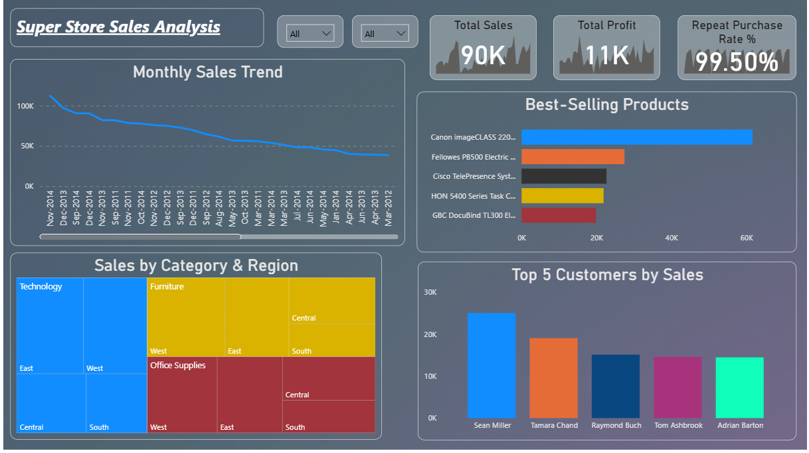

# FUTURE_DS_01
📊 Project Documentation
1. Project Title / Headline

🛒 Super Store Sales Analysis Dashboard
An interactive and visual Power BI dashboard built to monitor sales performance across categories, regions, and customer segments—highlighting profitability, product demand, and customer loyalty.

2. Short Description / Purpose

The Super Store Sales Analysis Dashboard is designed to provide decision-makers with a comprehensive view of sales performance, profitability, and customer behavior. It helps identify best-selling products, key customer segments, and regional sales trends to support data-driven business strategies.

3. Tech Stack

The dashboard was built using the following tools and technologies:

📊 Power BI Desktop – Main platform for data visualization and dashboard creation.

📂 Power Query – For cleaning, reshaping, and preparing raw sales data.

🧠 DAX (Data Analysis Expressions) – Used to calculate KPIs like total sales, total profit, and repeat purchase rate.

📝 Data Modeling – Established relationships among sales, customers, products, and regions for seamless cross-analysis.

📁 File Format – .pbix for development, .png for dashboard previews.

4. Data Source

Source:<a href="https://www.kaggle.com/datasets/mohamed38/superstoredataset" target="_blank">
  Superstore Dataset on Kaggle
</a>

Structure:

Sales Table: Order details including date, product, category, region, sales, and profit.

Customer Table: Customer names, IDs, and segment information.

Product Table: Product IDs, categories, and subcategories.

Region Table: Geographic segmentation (East, West, Central, South).

5. Features / Highlights
• Business Problem

The retail industry faces challenges in understanding which products drive revenue, which customers are most valuable, and how regional performance compares. Without clear insights, businesses risk misallocating resources and missing growth opportunities.

• Goal of the Dashboard

To provide a clear, visual, and interactive tool that:

Tracks overall sales and profit trends.

Highlights top-performing products and customers.

Compares sales across categories and regions.

Measures customer loyalty with repeat purchase metrics.

• Walkthrough of Key Visuals

KPI Cards (Top Right):

Total Sales: 90K

Total Profit: 11K

Repeat Purchase Rate: 99.5% (very high customer loyalty)

Monthly Sales Trend (Top Left):
A line chart showing sales performance over time. Sales appear to be declining gradually after late 2014, signaling potential issues in demand or retention.

Best-Selling Products (Top Center-Right):
A bar chart ranking top products.

Canon imageCLASS 2200 dominates sales with over 60K.

Other products include Fellowes PB500, Cisco TelePresence, HON 5400 Task Chairs, and GBC DocuBind.

Sales by Category & Region (Bottom Left):
A treemap displaying sales distribution.

Technology leads overall sales.

Furniture and Office Supplies follow, with regional variations (East & West regions strong in Technology, Central strong in Furniture).

Top 5 Customers by Sales (Bottom Right):
A bar chart showing most valuable customers:

Sean Miller contributes the highest sales (~27K).

Followed by Tamara Chand, Raymond Buch, Tom Ashbrook, and Adrian Barton.

• Business Impact & Insights

📈 Customer Loyalty: With a repeat purchase rate of 99.5%, the store has an extremely loyal customer base—providing a strong foundation for upselling and cross-selling strategies.

💰 Profitability Check: Despite high sales, total profit is relatively low (11K), suggesting thin margins or high costs.

🛒 Product Insights: One product (Canon imageCLASS 2200) dominates sales, creating dependency risk. Diversifying best-sellers is crucial.

🌍 Regional Strategy: Technology sells strongly in all regions, but Furniture and Office Supplies are more region-specific—indicating tailored marketing opportunities.

👤 Customer Value: A small set of customers (Top 5) contribute significantly to sales. Building deeper relationships with these customers could yield higher returns.

### 6.	Screenshots / Demos

